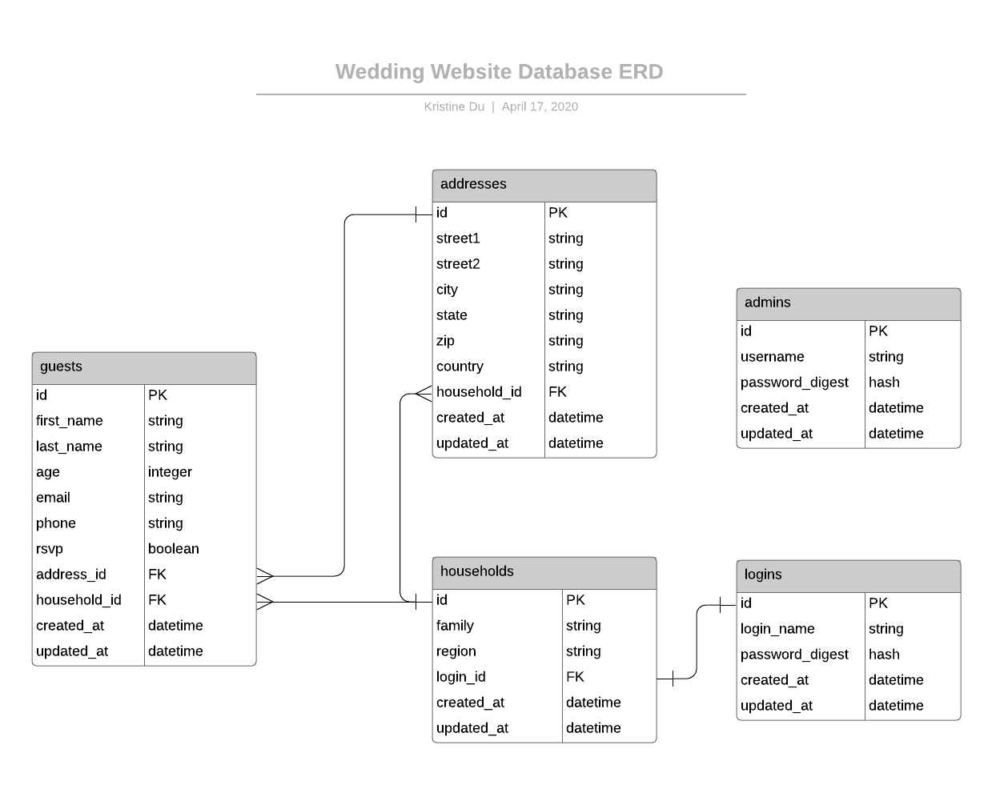

# Kristine & Samuel's Wedding - Backend

This is the backend API for my personal website that I'm building for my wedding. This API allows the frontend website to GET, POST, PATCH, and DELETE data related to the wedding. The database stores guest information and contact information, RSVPs, and logins for households and admins. 

Front-end respository: https://github.com/kadrianne/wedding-website

## Built With
Frontend: HTML, CSS, JavaScript, SASS, Bootstrap, Foundation Building Blocks 
Backend: Ruby v2.6.1, Rails API v6.0.2.2, PostgreSQL v12.2

## Database

This database is created on PostgreSQL to eventually be deployed to a live server. 

### Entity-Relationship Diagram

## Authentication

BCrypt is used for hashing login and admin passwords and JWT is used for authentication in order to encode/decode a payloads. Access to the API requires authentication for all actions with the exception of admin and guest login.

## Challenges

Setting up relationships to be able to access and show relationship via multiple models proved to be difficult without any visualization. Creating an ERD helped to lay out those relationships in an organized way.

## Future Implementation

- Deployment to production server
- Storing additional guest information i.e. food allergies, travel information